# 1.vue-cli2的使用

从字面上理解: 就是Vue的命令行工具.

官网: https://cli.vuejs.org/zh/guide/

Vue CLI 是一个基于 Vue.js 进行快速开发的完整系统

## 1.2 Vue-cli的作用

基于Vue快速构建一个标准的前端项目

## 1.3 Vue-cli的安装

### 1.3.1.打开命令行窗口

输入如下命令安装

```
npm i vue-cli -g
```

参数说明:

- i: install的简写
- vue-cli : 包的名称
- -g: 全局安装

出现如下效果表明安装完成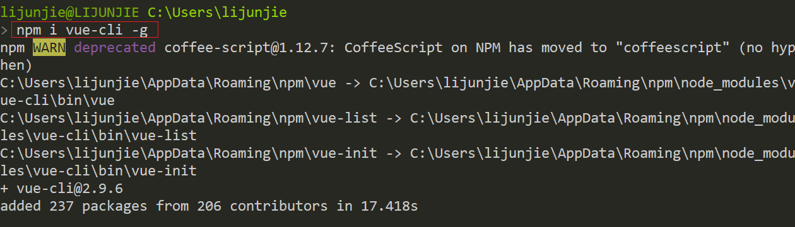

在C:\Users\Administrator\AppData\Roaming\npm目录下, 会多出这样几个文件

 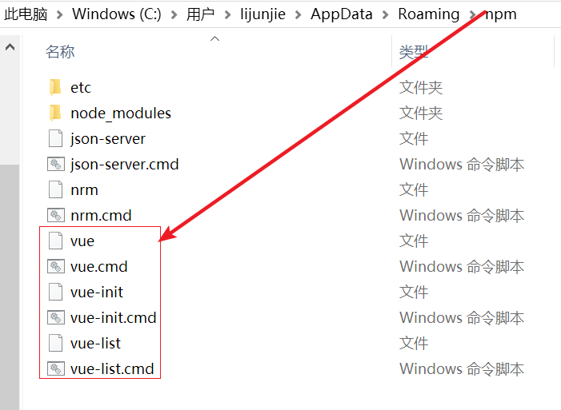

我们就可以在全局使用vue/vue-init/vue-list这些指令了.

其中, 主要是使用vue指令完成前端项目的生成

### 1.3.2.测试

在全局执行如下命令,

```
vue --version
```

如下图所示

 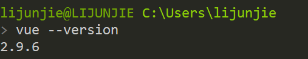

## 1.4 小结

1. vue-cli用来快速构建基本的前端项目
2. 使用npm i vue-cli -g安装vue-cli工具

## 2.1 创建项目

使用Vue-cli创建前端项目非常简单, 只需要执行一个命令就可以了

### 2.1.1. 打开cmd窗口

在桌面, shift+右键, 打开一个cmd窗口

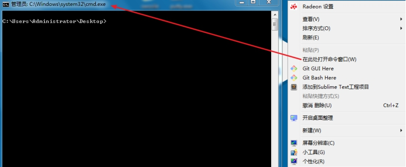 

### 2.1.2. 执行命令

```
vue init webpack first
```

参数说明:

- init: 创建项目
- webpack: 基于webpack模板
- first: 项目名称

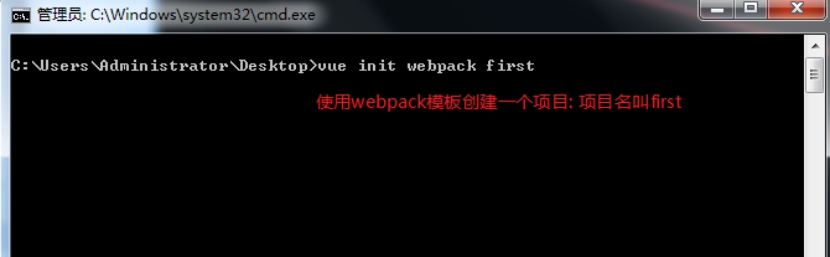 

### 2.1.3. 设置项目名称

接上一步, 在输入命令后, 经过一段时间, 会出现如下提示

设置项目的名称, 询问是否使用”first”做为项目名称, 直接按回车

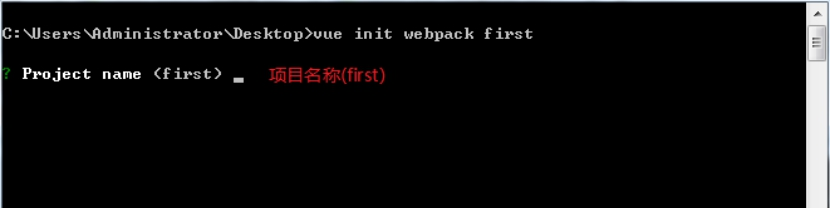 

### 2.1.4. 设置项目描述

接上一步, 回车后, 出现如下提示

询问是否使用”A vue.js project”做为项目描述, 可以直接按回车, 或者输入一些描述信息

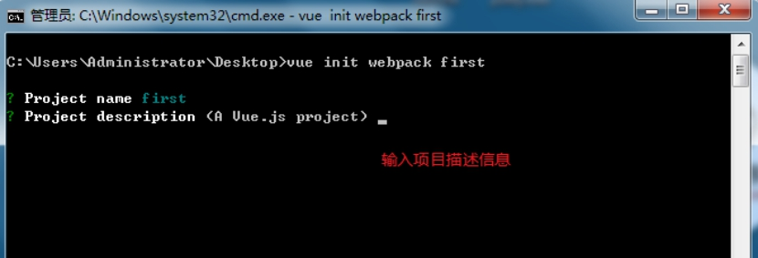 

比如: 我们可以输入:”My first vue project”回车

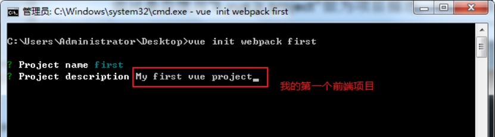 

### 2.1.5. 设置项目作者

接上一步, 回车后, 出现如下提示

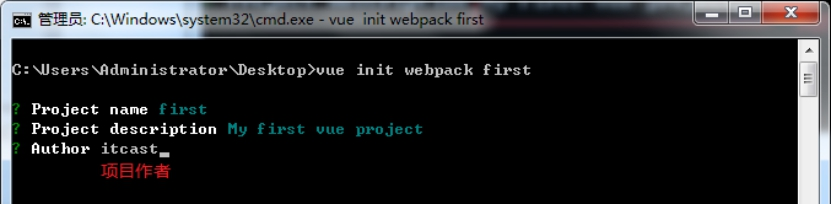 

### 2.1.6. 设置编译项

接上一步, 回车后, 出现如下提示, 直接按回车, 选择默认值

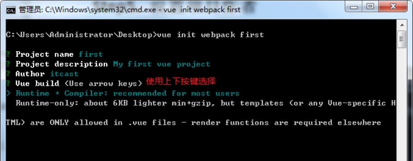 

在这里, 使用上下按键选择

使用默认值, recommended for most users ---- 推荐大部分用户使用

### 2.1.1. 是否使用vue-router

接上一步, 回车后, 出现如下提示

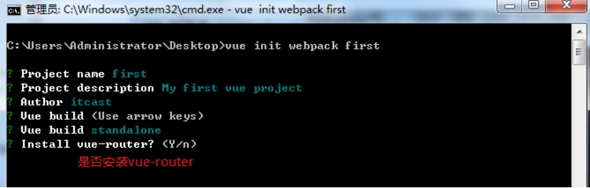 

按回车, 选择Y, 使用!!!

### 2.1.8. 是否使用ES语法检测规则

接上一步, 回车后, 出现如下提示

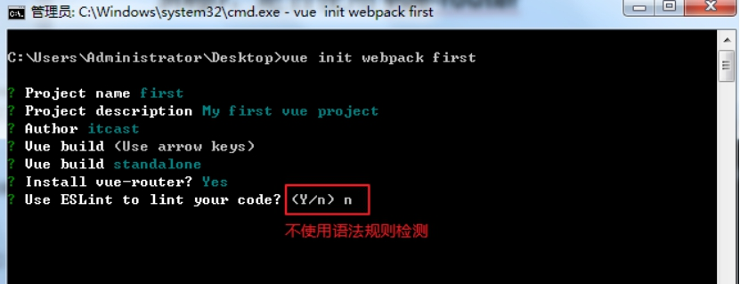 

输入n, 回车. 不使用语法规则检测. 

这里强烈推荐大家在初学的时候, **不使用这个检测!!!** 这个规则非常严格, 特别容易出错

 

### 2.1.9. 是否使用单元测试

接上一步, 回车后, 出现如下提示

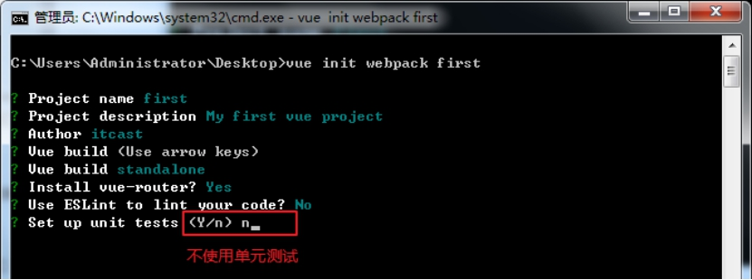 

输入n, 回车, 不使用单元测试

 

### 2.1.10. 是否使用点对点测试

接上一步, 回车后, 出现如下提示

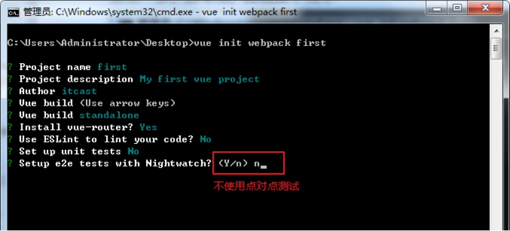 

输入n, 回车, 不使用点对点测试

 

### 2.1.11. 使用NPM安装所有的依赖包

接上一步, 回车后, 出现如下提示

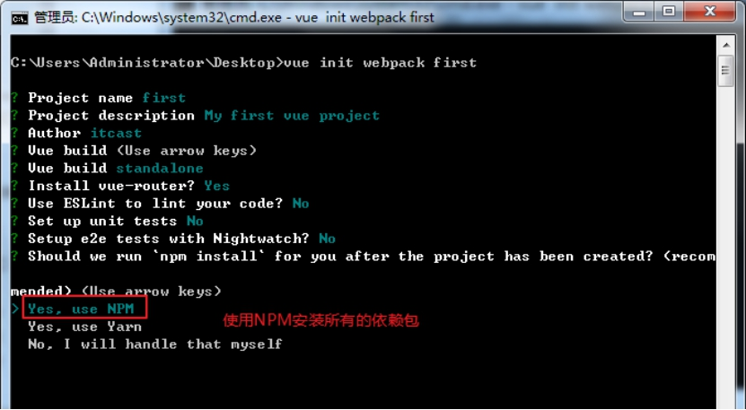 

开始安装

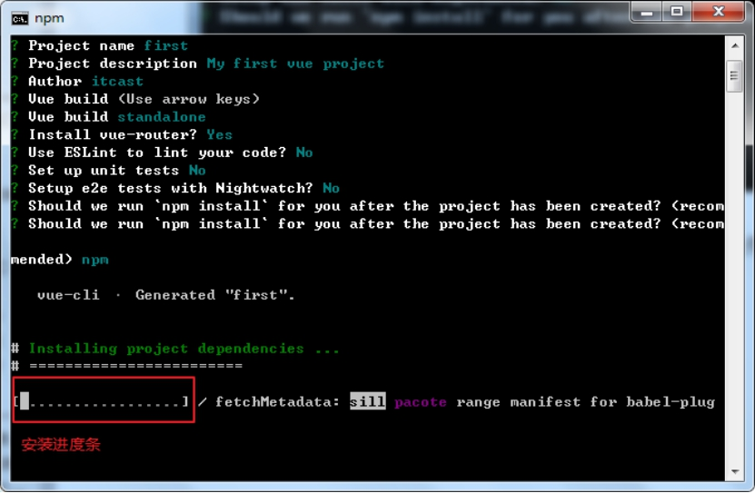 

安装完成, 出现如下提示

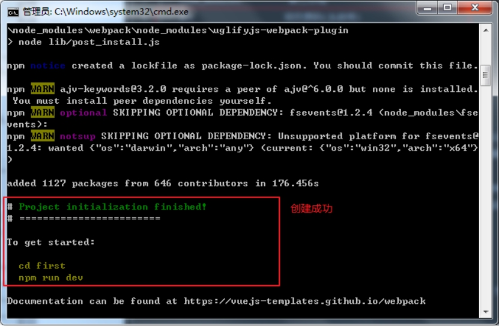 

### 2.1.12. 测试

进入到first目录

执行命令

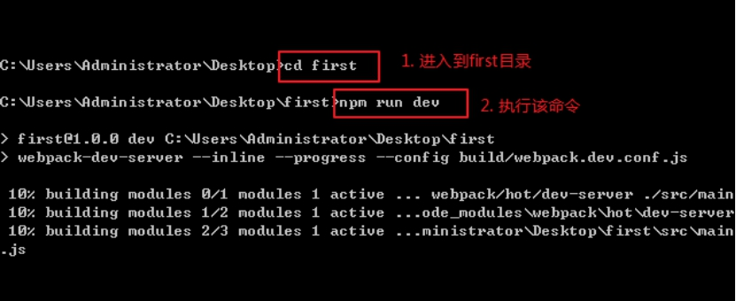 

 

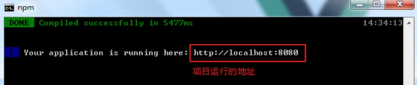 

在浏览器中输入http://localhost:8080, 打开项目

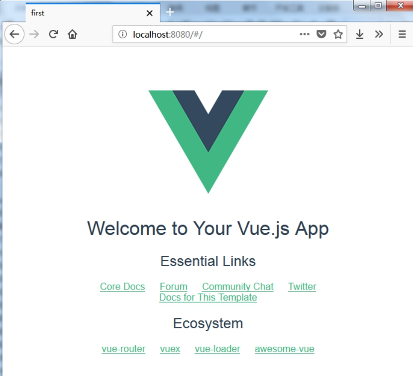 

在cmd命令窗口中, 按ctrl+c, 停止项目

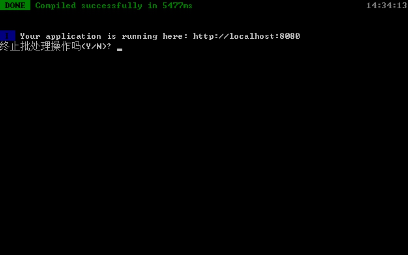 

输入y 回车, 就可以停止项目	

 

### **小技巧**

1. 在运行项目的同时, 打开浏览器
2. 制作启动命令

------

1. 修改package.json, 在dev选项后加上--open

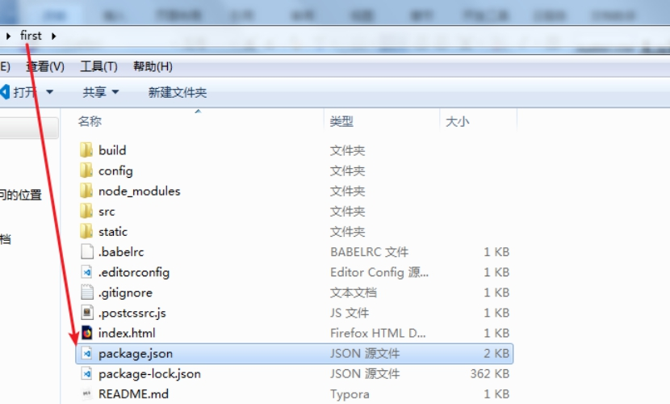 

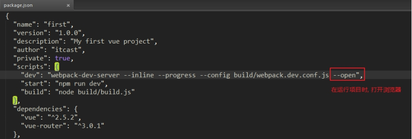 

1. 制作一个start.bat文件, 编写如下内容

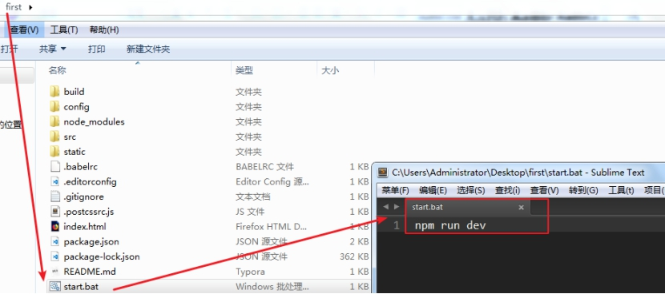 

### **提示**

1. 由于要下载比较多的文件, 容易受到网络的影响而失败. 如果失败, 删除目录后重新执行命令
2. 不要关闭cmd命令, 一旦关闭, 项目就停止了

## 2.2 目录结构

基于webpack创建的前端项目的目录结构如下:

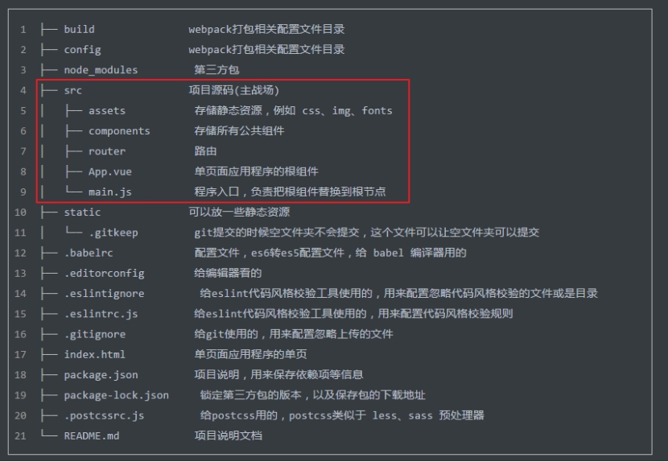 

我们主要的工作目录就是src, 其他的文件是跟打包相关的

### 